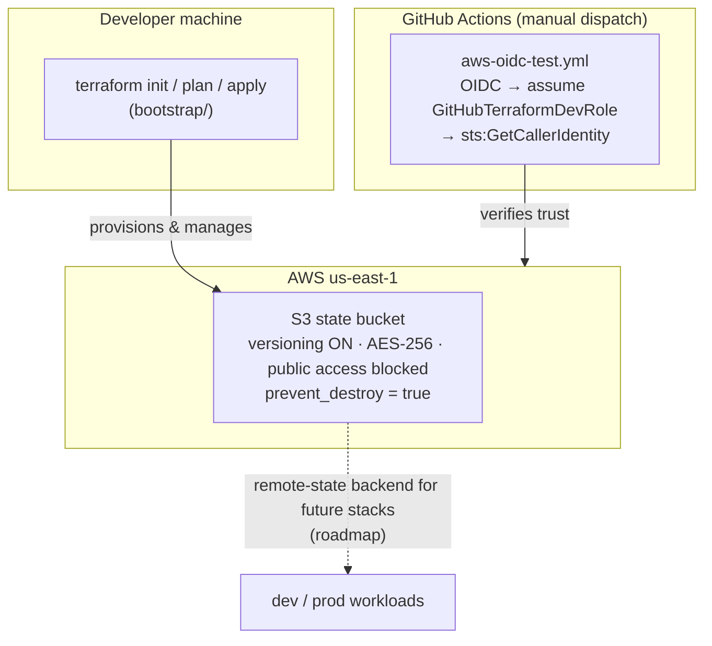

# Terraform — Remote-State Backend Bootstrap

Terraform infrastructure-as-code for Sai Mudunuri's AWS footprint.
Today this repo does one job, and does it carefully: it provisions the
**Terraform remote-state backend itself** — the versioned, encrypted S3
bucket every future Terraform stack will store its state in.

> **Note:** IaC repos don't get Helm charts — Terraform *is* the deployment
> tool here. There is deliberately no `k8s/` directory in this repo.

## Architecture



## What it provisions

`bootstrap/` creates, in `us-east-1`:

| Resource | Purpose |
|---|---|
| `aws_s3_bucket.terraform_state` | State bucket (`saimudunuri-terraform-state-823196744431-us-east-1`), `prevent_destroy = true`, `force_destroy = false` |
| `aws_s3_bucket_versioning` | Versioning **enabled** — every state change is recoverable |
| `aws_s3_bucket_server_side_encryption_configuration` | AES-256 encryption at rest |
| `aws_s3_bucket_public_access_block` | All four public-access blocks enabled |

`bootstrap/outputs.tf` exports the bucket name, ARN, and region for
downstream stacks to reference.

## Usage

Requires AWS credentials with permission to manage the state bucket
(account `823196744431`, region `us-east-1`):

```bash
cd bootstrap
terraform init
terraform plan
terraform apply
```

## CI

`.github/workflows/aws-oidc-test.yml` (manual dispatch) verifies the
GitHub → AWS OIDC trust: it assumes
`arn:aws:iam::823196744431:role/GitHubTerraformDevRole` via OIDC and runs
`aws sts get-caller-identity`. This is the same OIDC path future Terraform
Cloud/apply workflows will use — no long-lived AWS keys.

## Roadmap (not built yet)

- Reusable workload modules (VPC, EKS, ECR) — none exist in this repo yet
- Per-environment stacks (`dev`/`prod`) with remote-state backend config
  pointing at the bucket provisioned here
- `terraform plan` on pull requests with cost estimation

## Layout

```
Terraform/
├── bootstrap/
│   ├── main.tf        # S3 state bucket + hardening
│   ├── outputs.tf     # bucket name / ARN / region
│   ├── provider.tf    # aws provider, us-east-1, default tags
│   └── versions.tf    # Terraform ~> 1.15, AWS provider >= 6.57.1, < 7.0.0
└── .github/workflows/
    └── aws-oidc-test.yml
```

## License

MIT — see [LICENSE](LICENSE).
